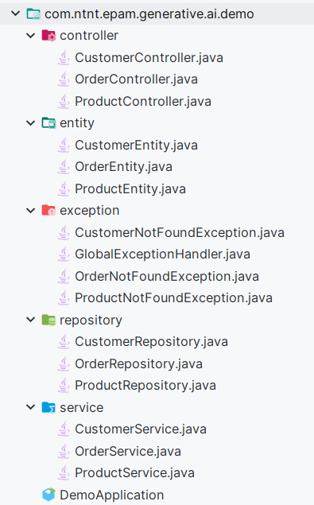

# Generative AI Tutorial
<br/>
<p style="text-align: center">
  
  
</p>

## 1. Generate code base using ChatGPT
**Before starting:** Make sure that your already have a base source code generate from https://start.spring.io

### 1.1. Tell ChatGPT to show the code base 
Text that we need to input:
> Generate spring code base contains these thing CustomerEntity, CustomerRepository, CustomerService, 
> CustomerController, OrderEntity, OrderRepository, OrderService, OrderController ProductEntity, ProductRepository, 
> ProductService ProductController. Start from this base package com.ntnt.epam.generative.ai.demo.service. It 
> include exception package which have a global exception handler and some not found exceptions for entities above. 
> It also include mapper package that support to map req to entity using mapstruct. No need to include main class. 
> Finally, Show me the code structure only

Result:
```
com.ntnt.epam.generative.ai.demo
├── controller
│   ├── CustomerController.java
│   ├── OrderController.java
│   └── ProductController.java
├── entity
│   ├── CustomerEntity.java
│   ├── OrderEntity.java
│   └── ProductEntity.java
├── exception
│   ├── EntityNotFoundException.java
│   ├── GlobalExceptionHandler.java
│   ├── ProductNotFoundException.java
│   └── CustomerNotFoundException.java
├── mapper
│   ├── CustomerMapper.java
│   ├── OrderMapper.java
│   └── ProductMapper.java
├── repository
│   ├── CustomerRepository.java
│   ├── OrderRepository.java
│   └── ProductRepository.java
└── service
    ├── CustomerService.java
    ├── OrderService.java
    └── ProductService.java

```
### 1.2. Tell ChatGPT to generate Powershell commands to generate this code base
Text that we need to input:
> Help me generate the powershell command to generate folders and files in com.ntnt.epam.generative.ai.demo. 
> I've already cd into com.ntnt.epam.generative.ai.demo

Result:
```
# Create subdirectories
New-Item -Name "controller" -ItemType Directory
New-Item -Name "entity" -ItemType Directory
New-Item -Name "exception" -ItemType Directory
New-Item -Name "repository" -ItemType Directory
New-Item -Name "service" -ItemType Directory

# Create controller files
New-Item -Name "controller\CustomerController.java" -ItemType File
New-Item -Name "controller\OrderController.java" -ItemType File
New-Item -Name "controller\ProductController.java" -ItemType File

# Create entity files
New-Item -Name "entity\CustomerEntity.java" -ItemType File
New-Item -Name "entity\OrderEntity.java" -ItemType File
New-Item -Name "entity\ProductEntity.java" -ItemType File

# Create exception files
New-Item -Name "exception\GlobalExceptionHandler.java" -ItemType File
New-Item -Name "exception\CustomerNotFoundException.java" -ItemType File
New-Item -Name "exception\OrderNotFoundException.java" -ItemType File
New-Item -Name "exception\ProductNotFoundException.java" -ItemType File

# Create repository files
New-Item -Name "repository\CustomerRepository.java" -ItemType File
New-Item -Name "repository\OrderRepository.java" -ItemType File
New-Item -Name "repository\ProductRepository.java" -ItemType File

# Create service files
New-Item -Name "service\CustomerService.java" -ItemType File
New-Item -Name "service\OrderService.java" -ItemType File
New-Item -Name "service\ProductService.java" -ItemType File
```
<figure style="text-align:center">
  
  <figcaption>Code structure result</figcaption>
</figure>

## 2. Generate code in each java class with GitHub Copilot

**Note:** First time we access to an Entity, Repository, Service, Controller,... classes, we'll see a blank file. We 
need to declare package in order to have a better result when generating code. After that, we can start to generate 
code.

**Tips:** Select all comment before generating code to make sure that we'll get the best result. (Select from the 
last line to the first line)
### 2.1 Generate code in an Entity class.

- Write a comment under package declaration to show what you want. For example:
```java
// Generate ProductEntity which have id (Long), name, price (BigDecimal), and type (Enum). Using Hibernate and 
// Lombok. With a rule is that the name of the table use in plural form. and use @Column to map camelCase to snake_case
```

- Choose the best result from GitHub Copilot tab. For example:
```java
import lombok.AllArgsConstructor;
import lombok.Getter;
import lombok.NoArgsConstructor;
import lombok.Setter;

import javax.persistence.*;
import java.math.BigDecimal;

@Entity
@Table(name = "products")
@Getter
@Setter
@NoArgsConstructor
@AllArgsConstructor
public class ProductEntity {
    @Id
    @GeneratedValue(strategy = GenerationType.IDENTITY)
    private Long id;
    private String name;
    private BigDecimal price;
    @Enumerated(EnumType.STRING)
    private ProductType type;
}
```
- Format the code and fix some generating errors to make it look better. And we also can create some additional 
stubs like ProductType Enum to complete the entity code.
- Continue to generate code for other entities.
- CustomerEntity example:
```java
// Generate ProductEntity which have id (Long), name, address, and phoneNumber. Using Hibernate and Lombok.
// With a rule is that the name of the table use in plural form. And use @Column to map camelCase to snake_case
```
- OrderEntity example:
```java
// Generate OrderEntity which includes id (Long), customerId, customerName, productId, amount (BigDecimal) and
// orderDate (Instant). Using Hibernate and Lombok. With a rule is that the name of the table use in plural form. And
// use @Column to map camelCase to snake_case. productId is id from ProductEntity and customerId is id from 
// CustomerEntity.
```
- After generating code for all entities, we can start to generate mapping such as `@ManyToOne`, `@OneToMany`, `@OneToOne`
  using line by line suggestion.

**Note:** Sometimes, GitHub Copilot tab can't show up the suggestions for us. We need to generate line by line to 
make it show up. 

### 2.2 Generate code in a Repository class.
No need to write comment we only need to fill the suggestions codes from GitHub Copilot tab.

For example:
```java
public interface ProductRepository extends JpaRepository<ProductEntity, Long> {
}
```
### 2.3 Generate DTOs & Mappers class.
- For DTOs we only need to create the class and add let the GitHub Copilot do the rest. If it does't understand we 
  just need to add some comments to help it understand which Entity class should be used.
- For Mapper we add some comment to tell it to help us generate the code. For example:
```java
// Help me generate CustomerMapper.java using Mapstruct to map CustomerCreateReq to CustomerEntity.
```

### 2.3 Generate code in a Service class.
- Same with Repository class, we only need to fill the suggestions codes from GitHub Copilot tab.
- We also need to modify the code to make it look better. And help GitHub Copilot generate better code in the next time.

### 2.4 Generate code in Controller class.
- Write a comment under package declaration to show what you want. For example:
```java
// Please help me generate CustomerController using spring boot rest controller which has 4 endpoints CRUD
// and using CustomerService to handle business logic. And using CustomerMapper to map entity to CustomerRes before
// return.
```
- Choose the best result from GitHub Copilot tab.
- You also need to modify to make the code complete and correct the mistakes.

## 3. Solutions for some other problems.
### 3.1. Cannot generate flyway migration code in sql files.
Solution 1: We need to go to specific Entity and write a comment like:
```java
//Generate flyway code to init this entity
```
And the result:
```sql
CREATE TABLE orders (
   id BIGINT(20) AUTO_INCREMENT PRIMARY KEY,
   customer_id BIGINT(20) NOT NULL,
   customer_name VARCHAR(255) NOT NULL,
   product_id BIGINT(20) NOT NULL,
   amount DECIMAL(19,2) NOT NULL,
   order_date TIMESTAMP NOT NULL,
   FOREIGN KEY (customer_id) REFERENCES customers (id),
   FOREIGN KEY (product_id) REFERENCES products (id)
);
```
Solution 2: We can copy that class to ChatGPT and tell it remember this class and tell it to help us generate flyway 
migration code.

### 3.2. Don't know how to config flyway.

We can ask ChatGPT to help us by writing this message:
> How to config flyway in spring boot project?

### 3.3. Generate similar class.
We can write a comment to tell GitHub Copilot to help us generate a class following convention of other class.
<br/>
For example we want to generate ProductMapper class:
```java
// Please help me to create ProductMapper interface similar with CustomerMapper
```
Or we want to generate ProductService class:
```java
// Please help me to create product service which has methods similar with CustomerService
```

